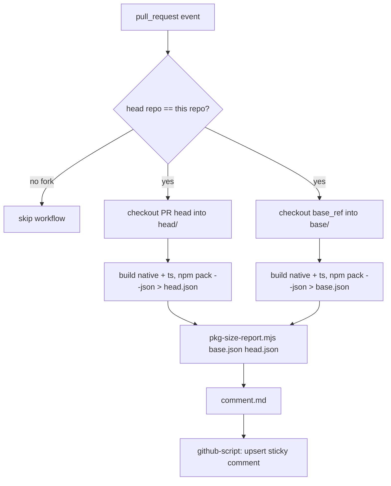

# PR Package-Size Comment — Design

**Date:** 2026-07-03
**Status:** Approved (pending spec review)

## Purpose

Give reviewers immediate, quantified feedback on how a pull request changes the
size of the published npm package, split into the two things that actually move:
the compiled **native binary** (Rust → `.node`) and the **JavaScript** output
(everything else that ships). A GitHub Action posts / updates a single sticky
comment on each PR with a before/after/delta table.

## Scope

- In: a new GitHub Actions workflow + a small, unit-tested Node script that
  classifies packed files and renders the comment.
- Out: fork-PR support (see Security), historical size tracking / badges,
  per-file breakdowns, size-gate enforcement (failing CI on growth).

## What ships, and how it's classified

The published tarball is defined by `package.json#files`:
`["dist", "native", "README.md", "LICENSE"]`. Measured via
`npm pack --dry-run --json`, which reports every included file's **unpacked**
size, the total **unpacked** size, and the total **packed** (gzipped) tarball
size.

Classification (single, explicit rule):

- **Native binary** — any file whose path ends in `.node`
  (`native/apple-silicon-metrics.darwin-arm64.node`).
- **JavaScript** — every other included file (`dist/**`, `native/index.cjs`,
  `native/index.d.cts`, `README.md`, `LICENSE`). This bucket is "everything that
  isn't the native binary," so **JS + Native = total unpacked size** and the
  numbers always reconcile. README/LICENSE are static and negligible; folding
  them in keeps the model simple.

Reported numbers:

| Row           | Source                                   | Meaning                          |
|---------------|------------------------------------------|----------------------------------|
| Native binary | sum of `.node` file unpacked sizes       | on-disk size after install       |
| JavaScript    | sum of non-`.node` file unpacked sizes   | on-disk size after install       |
| Tarball (gzip)| `npm pack` top-level packed `size`       | what users actually download     |

> Per-category **gzipped** size is intentionally not reported — `npm pack` does
> not expose per-file compressed sizes, and inventing them would be misleading.
> Unpacked per-category sizes + one honest packed total is the standard, correct
> split.

## Baseline

Compare against the **base branch built from source** (`github.base_ref`, i.e.
`main`), not the last npm release. This reflects exactly what merging *this* PR
changes, including work already on main that hasn't been released. Cost is a
second `cargo --release` native build; mitigated by `Swatinem/rust-cache`
(already used in CI). The pnpm store cache also makes the second `pnpm install`
cheap.

## Architecture / Data flow



### Components

**1. `scripts/pkg-size.ts`** (pure, testable — lives in `scripts/`, a directory for tooling that doesn't ship in the package but is still typechecked (`tsconfig.json` `include`) and vitest-tested (`vitest.config.ts` `include`); runs directly via Node 26 type-stripping, no build step)
- Input: paths to two `npm pack --dry-run --json` outputs (base, head). Either
  may be absent (e.g. base build failed / new package) — handled as zero.
- Logic: parse → classify each file → sum per bucket → compute deltas → format
  bytes (B / KB / MB, binary units) → render Markdown table with ▲/▼/▬ + signed
  deltas and percent change.
- Output: Markdown to stdout, led by a hidden marker `<!-- pkg-size-report -->`
  so the comment step can find & update it.
- No GitHub API calls, no network — just JSON in, Markdown out. This is the unit
  under test.
- Structure: exports pure functions (`classify`, `formatBytes`, `renderComment`)
  for the test to import; the CLI entry (`main()` reading argv) runs only when
  invoked directly, guarded by an `import.meta`/`process.argv[1]` check.

**2. `.github/workflows/pr-size.yml`**
- Trigger: `on: pull_request` (branches: `[main]`).
- Guard: job-level
  `if: github.event.pull_request.head.repo.full_name == github.repository` —
  fork PRs skip the whole job (no wasted runner minutes, no read-only-token
  failure).
- Runner: `macos-14` (arm64, required to build the addon).
- Permissions: `contents: read`, `pull-requests: write`.
- Steps:
  1. `actions/checkout` PR head → `path: head`.
  2. `actions/checkout` with `ref: ${{ github.base_ref }}` → `path: base`.
  3. Shared setup (pnpm, Node 26, Rust toolchain + `aarch64-apple-darwin`,
     rust-cache) — same versions as `ci.yml`.
  4. For each of `head/` and `base/`: `pnpm install --frozen-lockfile`,
     `pnpm run build`, `npm pack --dry-run --json > ../<name>.json`. The base
     build is wrapped so a failure produces an empty/absent json rather than
     failing the job (a broken base shouldn't block the PR comment).
  5. `node head/scripts/pkg-size-report.mjs base.json head.json > comment.md`.
  6. `actions/github-script` (first-party — no new third-party action, matching
     the security posture of `publish.yml`): read `comment.md`, find an existing
     comment containing the marker, update it if present else create it.

  The report is invoked as `node head/scripts/pkg-size.ts base.json head.json`.

**3. `scripts/pkg-size.test.ts`** (vitest, matching repo convention)
- Fixture JSON blobs (small hand-written `npm pack` shapes) → assert bucket sums,
  delta signs, byte formatting, new-file/removed-file edge cases, and
  missing-baseline behavior.

## Error handling / edge cases

- **Fork PR:** whole job skipped by the `if:` guard.
- **Base build fails / base is a brand-new package:** report treats missing base
  as zero and labels rows "new"; PR still gets a comment.
- **No size change:** still comment (updates sticky comment to show 0 delta) so a
  fixed-in-place comment never goes stale.
- **Native size unchanged (JS-only PR):** native row shows ▬ 0 — expected and
  useful confirmation that a JS change didn't perturb the binary.

## Testing

- Unit: `ts/pkg-size-report.test.ts` via existing `pnpm test` (vitest).
- Manual: open a draft PR touching (a) only TS, (b) only Rust, confirm the
  respective bucket moves and the comment updates in place on re-push.

## Comment format (target)

```
<!-- pkg-size-report -->
## 📦 Package size change

| Component      | Base    | This PR | Δ                |
|----------------|---------|---------|------------------|
| Native binary  | 1.20 MB | 1.22 MB | +18.4 KB (+1.5%) ▲ |
| JavaScript     | 42.1 KB | 43.0 KB | +0.9 KB (+2.1%) ▲  |
| **Tarball (gzip)** | **512 KB** | **515 KB** | **+3.0 KB (+0.6%) ▲** |

<sub>Compared against `main`. Unpacked sizes per component; tarball is the gzipped download.</sub>
```

## Decisions (resolved)

- Baseline = build base branch from source. ✔
- Metric = unpacked per-category (JS, native) + packed tarball total. ✔
- Comment = sticky, first-party `actions/github-script`, hidden marker. ✔
- Fork PRs = skipped (secure `pull_request`, no `pull_request_target`). ✔
